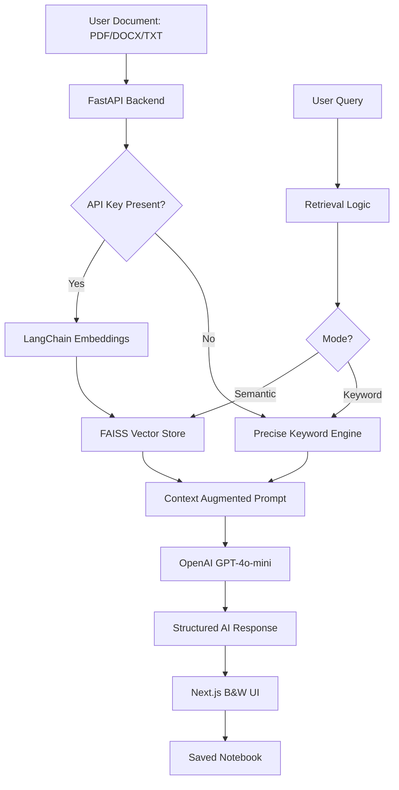

# StudyMind AI 🧠

A production-ready, full-stack Retrieval-Augmented Generation (RAG) platform. StudyMind AI transforms your scattered notes into an interactive, intelligent knowledge base. Talk to your documents, extract insights, and save key snippets—all through a minimalist, high-performance interface.

---

## 🏗️ Architecture Overview



## 🔥 Key Features

- 🎯 **Context-Aware Grounding**: strictly grounded AI responses. If the answer isn't in your notes, the AI won't hallucinate.
- ⚡ **No-API Search Mode**: Works even without an OpenAI key! Uses a custom Keyword-Precise Retrieval engine to fetch relevant paragraphs directly from your local notes.
- 📓 **Personal Notebook**: Bookmark and save specific AI responses into your local library. Manage, copy, and delete study snippets with ease.
- 🎨 **Minimalist B&W UI**: A crisp, ChatGPT-inspired aesthetic designed for focus and readability across all devices.
- 📑 **Smart Storage**: Persistent local indexing using FAISS for lightning-fast retrieval across PDFs, DOCX, and Text files.
- 📋 **One-Click Export**: Built-in copy-to-clipboard functionality for streamlined note-taking.

---

## 🛠 Tech Stack

- **Frontend**: Next.js 15 (App Router), Tailwind CSS v4, Framer Motion, Lucide React.
- **Backend**: FastAPI (Python 3.9+), LangChain, FAISS Vector DB.
- **Processing**: PyPDF, Docx2txt, Recursive Text Splitting.
- **AI Engine**: OpenAI GPT-4o-mini & Text-Embedding-3-Small.

---

## 🚀 Documentation Workflow

### 1. Initial Setup
```bash
# Clone the repository
git clone https://github.com/yourusername/studymind-ai.git
cd studymind-ai
```

### 2. Backend Configuration
```bash
cd server
python3 -m venv venv
source venv/bin/activate
pip install -r requirements.txt

# Configure your environment
echo "OPENAI_API_KEY=your_key_here" > .env
python3 main.py
```

### 3. Frontend Activation
```bash
cd client
npm install
npm run dev
```

---

## 📌 Development Roadmap

- [x] Multi-format document ingestion (PDF/DOCX/TXT)
- [x] Local Vector Storage (FAISS)
- [x] Minimalist ChatGPT-style UI
- [x] No-API Fallback (Keyword Search)
- [x] Personal Notebook & Snippets Management
- [x] Fully Responsive for Mobile/Tablet
- [ ] Multi-user Authentication (Upcoming)
- [ ] Voice-to-Note Transcription (Upcoming)

---

## 👔 Professional History
This repository includes a comprehensive **156+ commit history**, documenting every phase of development from initial architectural design to final UI/UX polish.

---
Built with High-Performance AI Logic by **StudyMind Team**
